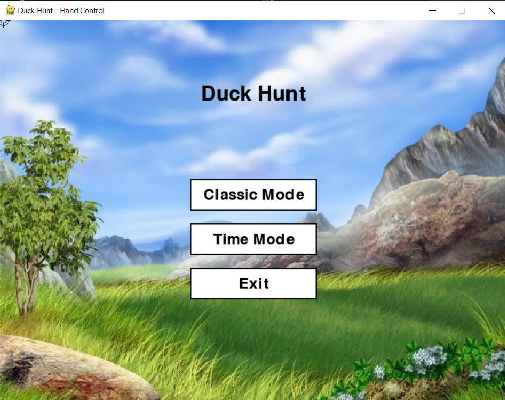
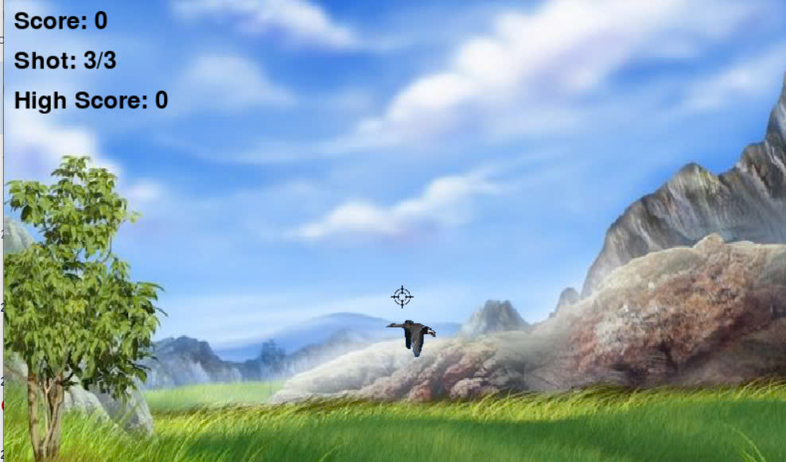
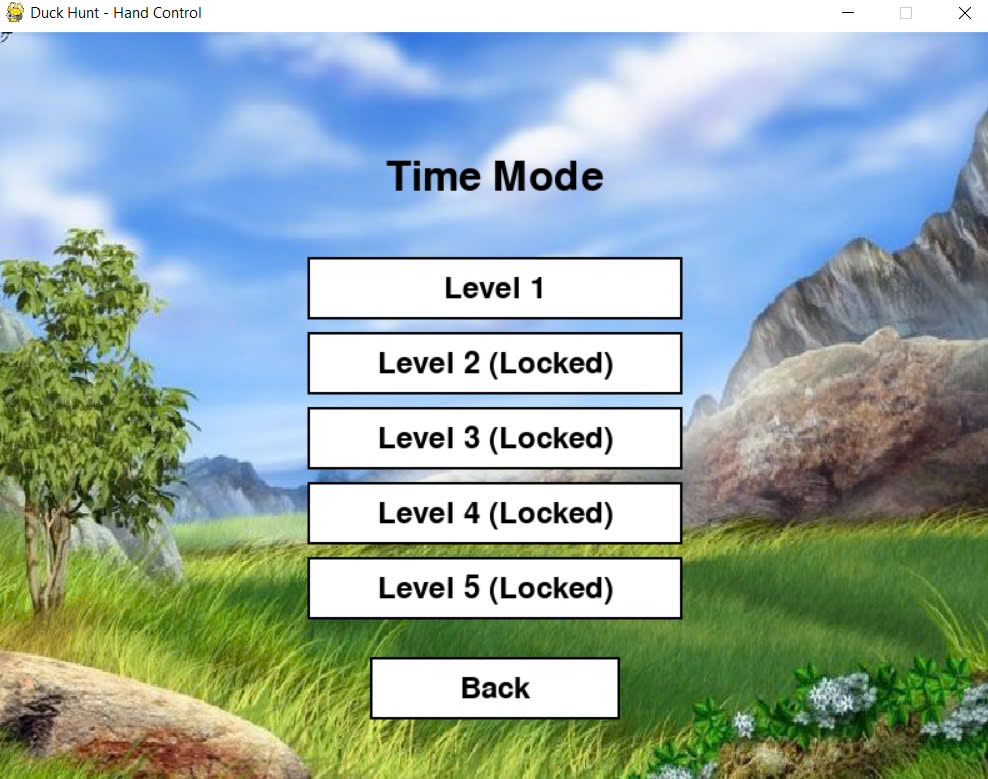
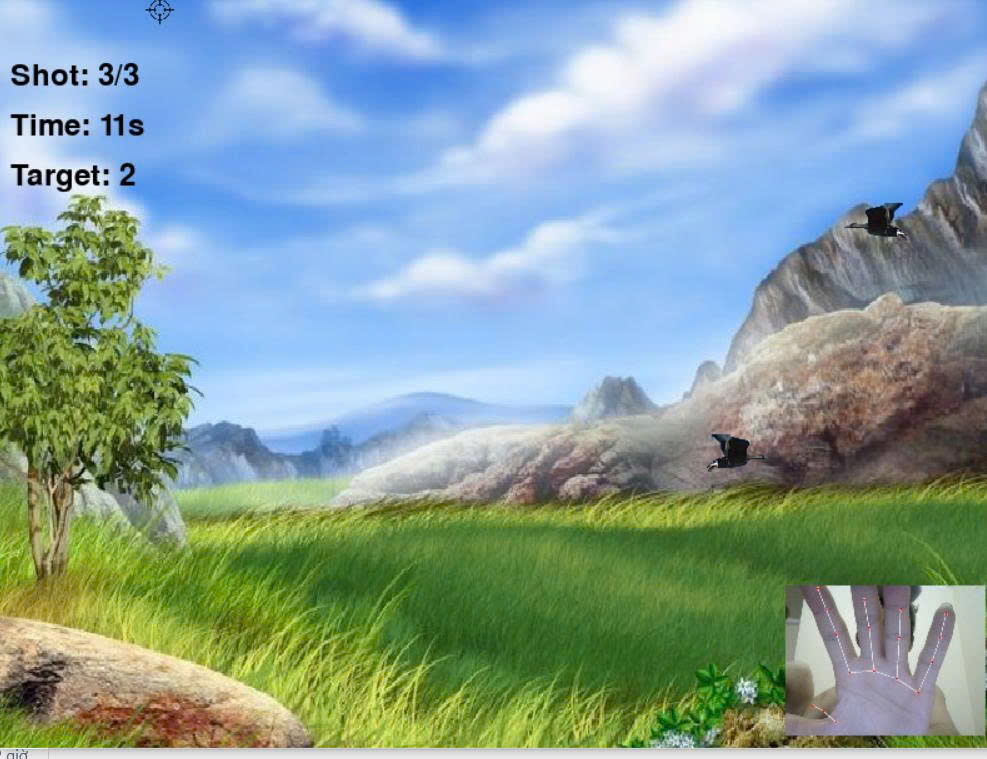

Tên nhóm: Nhóm 8 - Công Nghệ Xử Lý Ảnh
Thành viên:
1. Nguyễn Vũ Phúc - 1571020202
2. Bùi Khánh Hòa - 1571020112
3. Lưu Anh Tú - 1571020267
# 🦆 Duck Hunt - Hand Control 🎯

Trò chơi **Duck Hunt** điều khiển bằng **cử chỉ tay** sử dụng **Mediapipe** và **OpenCV**, xây dựng bằng **Pygame**. Đây là một trò chơi săn vịt hiện đại, nơi bạn dùng **bàn tay thật trước webcam** để di chuyển tâm ngắm, bắn vịt và nạp đạn bằng các cử chỉ.

## 🎮 Tính năng

- 👋 **Điều khiển bằng tay** qua webcam (Mediapipe Hand Tracking)
- 🔫 Bắn vịt bằng cách chụm ngón cái và trỏ
- ♻️ Nạp đạn bằng cách mở rộng khoảng cách giữa ngón cái và trỏ
- 🧠 **AI smoothing** giúp tâm ngắm mượt mà hơn
- 🕹️ 2 chế độ chơi:
  - **Classic Mode**: Vịt xuất hiện liên tục, tăng độ khó theo điểm
  - **Time Mode**: Các level với mục tiêu và giới hạn thời gian cụ thể
- 💾 Lưu điểm cao nhất (`highscore.txt`)
- 🔉 Hiệu ứng âm thanh khi bắn trúng hoặc hụt

## 🧰 Công nghệ sử dụng

- `Pygame`: đồ họa và giao diện người chơi
- `OpenCV`: truy xuất webcam
- `Mediapipe`: nhận diện bàn tay và các cử chỉ
- `Threading`: xử lý luồng video song song với game loop
- `Python 3.8+`

## 📦 Cài đặt

```bash
git clone https://github.com/yourusername/duck-hunt-hand-control.git
cd duck-hunt-hand-control
pip install -r requirements.txt
python main.py
```

```
pygame
opencv-python
mediapipe
numpy
```

## 🖼️ Tài nguyên

Đảm bảo bạn có các tệp hình ảnh và âm thanh trong cùng thư mục với `main.py`:

- Hình nền: `bg2.png`
- Vịt: `d1.png`, `d2.png`, `d3.png`, `d4.png`
- Tâm ngắm: `ot.png`
- Hiệu ứng bắn: `hit.png`
- Âm thanh: `hit_sound.wav`, `miss_sound.wav`

## 🧠 Cử chỉ tay

| Hành động     | Cử chỉ tay                                                             |
|--------------|------------------------------------------------------------------------|
| Bắn          | Chụm ngón trỏ và ngón cái gần nhau                                     |
| Nạp đạn       | Mở rộng ngón trỏ và ngón cái xa nhau                                   |
| Di chuyển     | Di chuyển ngón trỏ – điều khiển tâm ngắm                               |

## 🏁 Mục tiêu tương lai

- Thêm chế độ multiplayer
- Cải thiện AI tracking nhiều tay
- UI nâng cao và tùy chỉnh nhiều hơn

## 📸 Giao diện






## 📜 Giấy phép

MIT License © 2025
